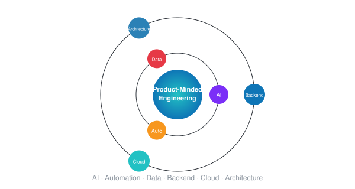

# Khaleef Z

  

  

---

  <a href="#about">About</a> ·
  <a href="#what-i-build">What I Build</a> ·
  <a href="#technology">Technology</a> ·
  <a href="#engineering-approach">Engineering Approach</a> ·
  <a href="#education">Education</a> ·
  <a href="#current-focus">Current Focus</a> ·
  <a href="#github">GitHub</a> ·
  <a href="#connect">Connect</a>

---

## About

Full-Stack Developer with an academic background in Decision & Computing Sciences, focused on building reliable software, data-driven applications, and intelligent systems.

I work across the full product lifecycle — understanding the problem, designing the solution, building and deploying it, and iterating based on results — with a particular interest in how software and data combine to make complex processes simpler and more effective.

**Core areas:** Software Engineering · Full-Stack Development · Data Analytics & Decision Systems · Artificial Intelligence & Machine Learning · Product Development

---

## What I Build

  

**Full-Stack Applications**
Modern web applications built with clean user experiences, scalable backend architecture, secure authentication, RESTful APIs, and thoughtful database design.

**Data & Analytics**
Transforming raw data into actionable insight through data cleaning, exploratory analysis, statistical modelling, visualization, and business intelligence.

**AI & Intelligent Systems**
Practical applications of AI and machine learning, including predictive modelling, classification, recommendation systems, and intelligent automation.

---

## Technology

**Languages & Frameworks**

  

  

**Databases & Infrastructure**

  

  

**Data & Machine Learning**

  
  
  
  
  

**Development & API Tools**

  
  
  

---

## Engineering Approach

> Understand the problem before building the solution.

  

I value clear problem definition, simple and maintainable architecture, thoughtful user experience, and data-informed decision-making.

---

## Education

**MSc, Decision & Computing Sciences** — 5-Year Integrated Programme

A foundation spanning software development, computing, data analytics, statistics, decision sciences, and machine learning.

---

## Current Focus

  

Growing as a product-minded software engineer at the intersection of engineering, data, and AI, with active focus on AI-powered products, intelligent automation, scalable backend systems, and cloud deployment.

---

## GitHub

  

  
  

  

---

## Connect

  
  
  

---

  <strong>Building practical software. Solving meaningful problems. Continuously improving.</strong>

